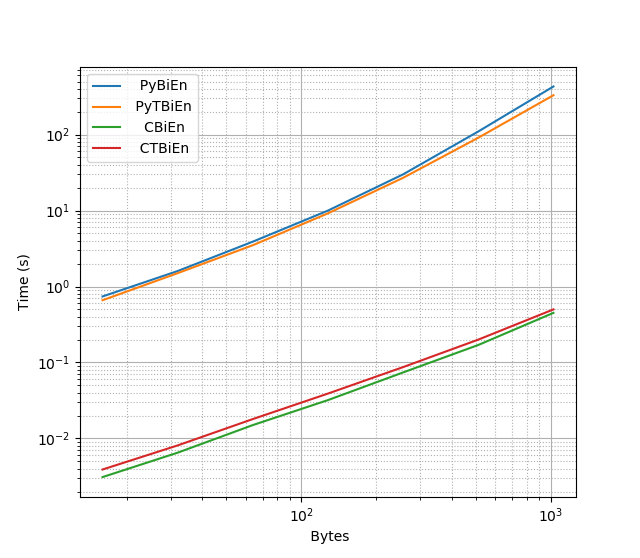

BiEntropy Randomness Metrics for Python
=======================================

This Python package provides high-performance implementations of the functions
and examples presented in "BiEntropy - The Approximate Entropy of a Finite
Binary String" by Grenville J.  Croll, presented at ANPA 34 in 2013.
https://arxiv.org/abs/1305.0954

According to the paper, BiEntropy is "a simple algorithm which computes the
approximate entropy of a finite binary string of arbitrary length" using "a
weighted average of the Shannon Entropies of the string and all but the last
binary derivative of the string." In other words, these metrics can be used to
help assess the disorder or randomness of binary or byte strings, particularly
those that are too short for other randomness tests.

This module includes both a Python C extension and a pure Python module
implementing the BiEn and TBiEn metrics from the paper, as well as a suite of
tests that verify their correctness. These implementations are available under
the submodules 'cbientropy' and 'pybientropy'.

Aliases of C versions of BiEn and TBiEn are included at the top level of this
module for convenience.


Basic Usage
-----------

The `bien` and `tbien` functions support both binary (i.e., not unicode) strings
and object types, such as those provided by the  `bitstring` package, that have
both a `tobytes()` method and a `len()` method that returns the length in bits.

```
In [1]: from bientropy import bien, tbien

In [2]: from bitstring import Bits

In [3]: bien(Bits('0b1011')), tbien(Bits('0b1011'))
Out[3]: (0.9496956846525874, 0.9305948708049089)

In [4]: bien(Bits('0xfa1afe1')), tbien(Bits('0xfa1afe1'))
Out[4]: (0.05957853232204588, 0.7189075024152897)

In [6]: bien(b'\xde\xad\xbe\xef'), tbien(b'\xde\xad\xbe\xef')
Out[6]: (0.060189286721883305, 0.7898265151674035)

```

See [demo.py](/bientropy/demo.py) for more examples.


Performance
-----------

According to the paper, the "BiEntropy algorithm evaluates the order and
disorder of a binary string of length n in O(n^2) time using O(n) memory." In
other words, the run time has quadratic growth and the memory requirement has
linear growth with respect to the string length.

The metrics are implemented in Python using the 'bitstring' package for
handling arbitrary length binary strings and in native C using the GNU Multiple
Precision (GMP) arithmetic library.

The following is a table of speed-ups from the Python to the C implementation
for various string byte lengths:

| Bytes | BiEn    | TBiEn   |
|-------|---------|---------|
|    16 |     229 |     155 |
|    32 |     217 |     149 |
|    48 |     212 |     150 |
|    64 |     221 |     161 |
|   128 |     267 |     196 |
|   256 |     340 |     257 |
|   512 |     502 |     370 |
|  1024 |     802 |     537 |

Following is a log-log plot of the average time to compute the various
implementations of BiEntropy on a 2.40GHz Intel(R) Xeon(R) E5645 CPU versus the
length of the input in bytes.




Requirements
------------

This package is tested with Python versions 2.7, 3.4, 3.5 and 3.6.

Installation:
* Python http://python.org/ (>= 2.7 or >= 3.4)
* bitstring http://pythonhosted.org/bitstring/
* NumPy http://numpy.org/

Compiling:
* GCC http://gcc.gnu.org/ on Linux
* MSVC 9 if using Python 2.7 on Windows
  * https://www.microsoft.com/EN-US/DOWNLOAD/confirmation.aspx?id=44266
* MSVC 14 if using Python 3.x on Windows
  * http://landinghub.visualstudio.com/visual-cpp-build-tools
* GMP http://gmplib.org/ or MPIR http://mpir.org/ on Windows

For running tests:
* mock https://pypi.org/project/mock/ if using Python 2.7


Install from pip
----------------

This package includes a C extension which has to be compiled for each platform.
Python wheels include compiled binary code and allow the extension to be
installed without requiring a compiler.

`pip >= 1.4` with `setuptools >= 0.8` will use a wheel if there is one
available for the target platform:
```
pip install --user BiEntropy
```

Once installed, the tests should be run with the command:
```
python -m bientropy.test_suite
```

A list of available wheel files is available at:
https://pypi.org/project/BiEntropy/#files


Install from Source
-------------------

The source code for the `bientropy` package can be cloned or downloaded from:
* GitHub: https://github.com/sandialabs/bientropy
* PyPI: https://pypi.org/project/BiEntropy

The [GMP library](http://gmplib.org/) and headers need to be installed before
compiling.

On Debian/Ubuntu:
```
apt-get install libgmp-dev
```

On RedHat:
```
yum install gmp-devel
```

Then, use `setup.py` to compile and install the package:
```
python setup.py install --user
```

Once installed, the tests should be run with the command:
```
python -m bientropy.test_suite
```


Compiling on Windows
--------------------

Compiling GMP on Microsoft Windows is only supported under Cygwin, MinGW or
DJGPP. However, this package can be compiled with MPIR, a fork of GMP, on
Windows. The source for MPIR is available at http://mpir.org/
The `setup.py` script expects the header files, library files and DLL to be
available under `mpir/dll/x64/Release`.

A compiled distribution of the MPIR library was also available at:
http://www.holoborodko.com/pavel/mpfr/#download
To use it, download the `MPFR-MPIR-x86-x64-MSVC2010.zip` file and extract `mpir` from the
ZIP file to this directory.

Once MPIR is ready, proceed as usual.
```
python setup.py install --user
```

After installing, the tests should be run with the command:
```
python -m bientropy.test_suite
```


Included Scripts
----------------

After installing, a demonstration can be run with this command:
```
python -m bientropy.demo
```
This file (`bientropy/demo.py`) also serves as a good example for using
the package.

The same benchmark script used to generate the data shown in the table and plot
above is also included. It can be run with:
```
python -m bientropy.benchmark
```


Development
-----------

To compile with debug symbols and with extra output, use:
```
python setup.py build_ext --force --debug --define DEBUG
```

To also disable compiler optimizations, use:
```
CFLAGS=-O0 python setup.py build_ext --force --debug --define DEBUG
```

To debug the extension with GDB:
```
$ gdb python
(gdb) run setup.py test
```

To run the Valgrind memcheck tool to check for memory corruption and leaks:
```
valgrind --xml=yes --xml-file=valgrind.xml ${python} setup.py test
```


Authors
-------

This package, consisting of the C implementations, Python implementations and
Python bindings were written by Ryan Helinski <rhelins@sandia.gov>.


License
-------
Copyright 2018 National Technology & Engineering Solutions of Sandia, LLC
(NTESS). Under the terms of Contract DE-NA0003525 with NTESS, the U.S.
Government retains certain rights in this software.

This program is free software: you can redistribute it and/or modify
it under the terms of the GNU General Public License as published by
the Free Software Foundation, either version 3 of the License, or
(at your option) any later version.

This program is distributed in the hope that it will be useful,
but WITHOUT ANY WARRANTY; without even the implied warranty of
MERCHANTABILITY or FITNESS FOR A PARTICULAR PURPOSE.  See the
GNU General Public License for more details.

You should have received a copy of the GNU General Public License
along with this program.  If not, see <http://www.gnu.org/licenses/>.
